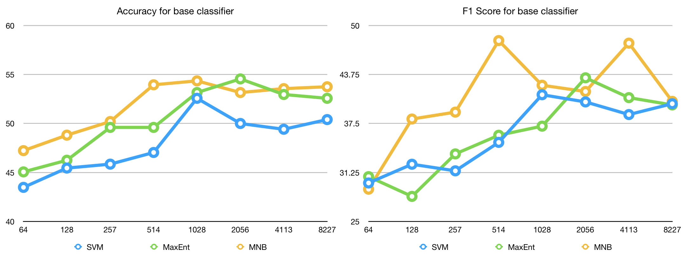
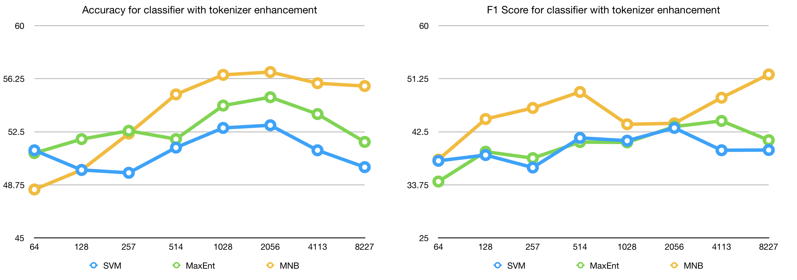
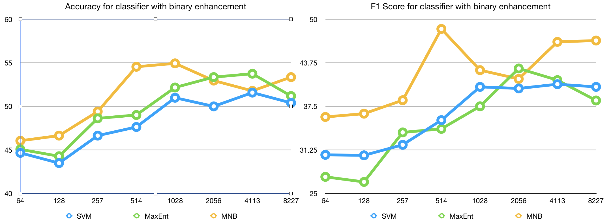
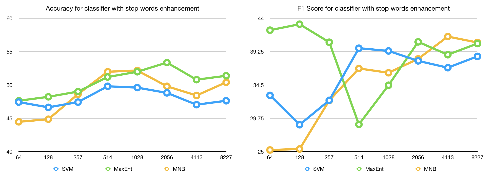
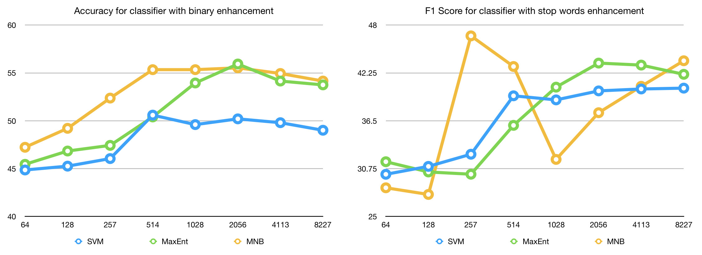

# Ejercicio 1
InterTASS Statistics
================
Tweets: 1008
Tweets per sentiment: {'NONE': 139, 'N': 418, 'P': 318, 'NEU': 133}

GeneralTASS Statistics
================
Tweets: 7219
Tweets per sentiment: {'NONE': 1483, 'NEU': 670, 'P': 1232, 'N+': 847, 'P+': 1652, 'N': 1335}

# Ejercicio 2
## Evaluación para classifier base (sin mejoras) (usando MNB)

Sentiment P:
  Precision: 49.22% (127/258)
  Recall: 81.41% (127/156)
  F1: 61.35%
Sentiment N:
  Precision: 58.61% (143/244)
  Recall: 65.30% (143/219)
  F1: 61.77%
Sentiment NEU:
  Precision: 0.00% (0/1)
  Recall: 0.00% (0/69)
  F1: 0.00%
Sentiment NONE:
  Precision: 66.67% (2/3)
  Recall: 3.23% (2/62)
  F1: 6.15%
Accuracy: 53.75% (272/506)
Macro-Precision: 43.62%
Macro-Recall: 37.48%
Macro-F1: 40.32%
	P	N	NEU	NONE
P	127	28	1	0	
N	75	143	0	1	
NEU	35	34	0	0	
NONE	21	39	0	2

## Evaluación para classifier con Tokenizer (usando MNB)

Sentiment P:
  Precision: 50.00% (134/268)
  Recall: 85.90% (134/156)
  F1: 63.21%
Sentiment N:
  Precision: 61.86% (146/236)
  Recall: 66.67% (146/219)
  F1: 64.18%
Sentiment NEU:
  Precision: 100.00% (0/0)
  Recall: 0.00% (0/69)
  F1: 0.00%
Sentiment NONE:
  Precision: 100.00% (2/2)
  Recall: 3.23% (2/62)
  F1: 6.25%
Accuracy: 55.73% (282/506)
Macro-Precision: 77.97%
Macro-Recall: 38.95%
Macro-F1: 51.95%
	P	N	NEU	NONE
P	134	22	0	0	
N	73	146	0	0	
NEU	37	32	0	0	
NONE	24	36	0	2

## Evaluación para classifier con Binary (usando MNB)

Sentiment P:
  Precision: 48.11% (127/264)
  Recall: 81.41% (127/156)
  F1: 60.48%
Sentiment N:
  Precision: 59.17% (142/240)
  Recall: 64.84% (142/219)
  F1: 61.87%
Sentiment NEU:
  Precision: 100.00% (0/0)
  Recall: 0.00% (0/69)
  F1: 0.00%
Sentiment NONE:
  Precision: 50.00% (1/2)
  Recall: 1.61% (1/62)
  F1: 3.12%
Accuracy: 53.36% (270/506)
Macro-Precision: 64.32%
Macro-Recall: 36.97%
Macro-F1: 46.95%
	P	N	NEU	NONE
P	127	29	0	0	
N	76	142	0	1	
NEU	37	32	0	0	
NONE	24	37	0	1

## Evaluación para classifier con Stopwords (usando MNB)

Sentiment P:
  Precision: 48.11% (127/264)
  Recall: 81.41% (127/156)
  F1: 60.48%
Sentiment N:
  Precision: 59.17% (142/240)
  Recall: 64.84% (142/219)
  F1: 61.87%
Sentiment NEU:
  Precision: 100.00% (0/0)
  Recall: 0.00% (0/69)
  F1: 0.00%
Sentiment NONE:
  Precision: 50.00% (1/2)
  Recall: 1.61% (1/62)
  F1: 3.12%
Accuracy: 53.36% (270/506)
Macro-Precision: 64.32%
Macro-Recall: 36.97%
Macro-F1: 46.95%
	P	N	NEU	NONE
P	127	29	0	0	
N	76	142	0	1	
NEU	37	32	0	0	
NONE	24	37	0	1	

## Evaluación para classifier con Stemmer (usando MNB)

Sentiment P:
  Precision: 47.60% (129/271)
  Recall: 82.69% (129/156)
  F1: 60.42%
Sentiment N:
  Precision: 61.80% (144/233)
  Recall: 65.75% (144/219)
  F1: 63.72%
Sentiment NEU:
  Precision: 0.00% (0/1)
  Recall: 0.00% (0/69)
  F1: 0.00%
Sentiment NONE:
  Precision: 100.00% (1/1)
  Recall: 1.61% (1/62)
  F1: 3.17%
Accuracy: 54.15% (274/506)
Macro-Precision: 52.35%
Macro-Recall: 37.51%
Macro-F1: 43.71%
	P	N	NEU	NONE
P	129	27	0	0	
N	75	144	0	0	
NEU	40	29	0	0	
NONE	27	33	1	1	

## Usando MaxEnt y Normalize
N:
	portada buena enhorabuena gracias besos ([-1.57715346 -1.43077929 -1.42759817 -1.41947805 -1.36450289])
	odio déficit recortes muertos triste ([1.67245173 1.68052673 1.78226637 2.04207147 2.42096464])
NEU:
	parados cree enhorabuena cuenta puedes ([-1.11954992 -0.9983356  -0.93920133 -0.90387812 -0.86701282])
	decidirán broma palomacervilla expectación huelga ([1.26041256 1.2680634  1.30022571 1.32740288 1.34231888])
NONE:
	feliz gracias interesante gran enhorabuena ([-1.9528077  -1.93897274 -1.8415467  -1.79116806 -1.70262618])
	periódico sesión jugar reunión portada ([1.2181315  1.30945317 1.38032478 1.45742902 2.20772105])
P:
	portada triste culpa urdangarin griñan ([-1.66219324 -1.54530417 -1.42483773 -1.3170716  -1.27912745])
	genial homenaje gracias felicidades enhorabuena ([1.8508451  2.00516344 2.14243202 2.27528081 2.44821406])

@carlotalotalota Me apena que haya pasado esto porque la idea de crear un colectivo estatal con divisiones locales era algo poderoso 

algo [ 0.54406685  0.15367577  0.10660248 -0.76942233]
apena [ 0.08716844 -0.01385344 -0.06456771 -0.06437888]
carlotalotalota [ 0.08716844 -0.01385344 -0.06456771 -0.06437888]
colectivo [ 0.08716844 -0.01385344 -0.06456771 -0.06437888]
con [-0.3438863   0.09645832  0.01974203  0.12109475]
crear [-0.18735127 -0.68125098 -0.22076443  0.8491108 ]
de [ 0.14313472 -0.05571002 -0.17630602 -0.05664472]
divisiones [ 0.08716844 -0.01385344 -0.06456771 -0.06437888]
era [ 0.14246229 -0.20016231  0.17403955 -0.08407913]
estatal [ 0.08716844 -0.01385344 -0.06456771 -0.06437888]
esto [ 0.679107    0.2184958   0.17890024 -0.8598062 ]
haya [-0.09409869 -0.15786105 -0.24696208  0.40199647]
idea [ 0.31102636 -0.1028394  -0.01548629 -0.18548697]
la [ 0.18916674  0.0309991  -0.39759878 -0.00822757]
locales [ 0.38020387 -0.26120633  0.05674    -0.24905883]
me [ 0.23602994  0.1922715  -0.52411377 -0.04306281]
pasado [ 0.41810092 -0.18666007 -0.17198684 -0.05557817]
poderoso [ 0.08716844 -0.01385344 -0.06456771 -0.06437888]
porque [ 0.76276971 -0.22083081 -0.16194584 -0.56350989]
que [ 0.04379144  0.11774249 -0.27089475  0.01930536]
un [ 0.1964639  -0.08890605 -0.49755396  0.10166797]

# Ejercicio 3
Usando MNB con mejora de Tokenizer:

Sentiment P:
  Precision: 51.30% (533/1039)
  Recall: 83.02% (533/642)
  F1: 63.41%
Sentiment N:
  Precision: 62.12% (528/850)
  Recall: 68.84% (528/767)
  F1: 65.31%
Sentiment NEU:
  Precision: 0.00% (0/1)
  Recall: 0.00% (0/216)
  F1: 0.00%
Sentiment NONE:
  Precision: 33.33% (3/9)
  Recall: 1.09% (3/274)
  F1: 2.12%
Accuracy: 56.03% (1064/1899)
Macro-Precision: 36.69%
Macro-Recall: 38.24%
Macro-F1: 37.45%
	P	N	NEU	NONE
P	533	105	1	3	
N	238	528	0	1	
NEU	112	102	0	2	
NONE	156	115	0	3	
